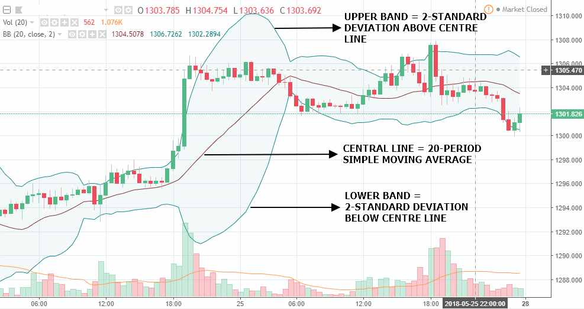
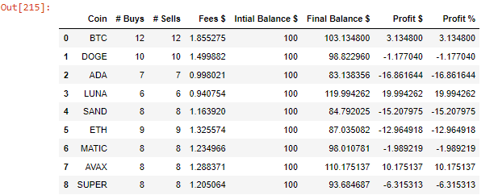

### Project
Binance Crypto Trading Bot - Boolinger Bands Strategy

### Main Goal
The main goal of this project was to develop a back test enviroment in python to deploy a crypto trading bot using the Binance API to gather crypto's historical data. The trading strategy used was the Bollinger Bounce Strategy.The created environment allows simultaneous analysis of different digital assests traded on Binance, testing of different trading strategies, and visualizing the trade's data on graphs. The results of this project provided a rough estimate of weather using this bot for live trading on the selected cryptocurrencies would have been profitable over the month of February, 2022. 

### Data
The historical data was gathered using the BackTest_GatherData.py and saved to a .csv file.
* Digital Assets Traded: Bitcoin, DogeCoin, Cardano, Luna, SandBox, Ethereum, Polygon, Avalanche and SuperFarm
* Data Time Frame: 1h chart from 01.02.22 - 01.03.22

### Bollinger Bounce Strategy
The Boolinger Bands are a technical indicator developed by John Bollinger and are used to measure volatility and to indentify "overbought" and "oversold conditions.
Most Bollinger applications use a 20-period moving average and the upper and lower bands are then calculated as two standard deviations from the middle band.
       
 
       
Bollinger Bands Calculation:
* Upper Band = Middle band + 2 standard deviations
* Middle Band = 20-period moving average (most charting packages use the simple moving average)
* Lower Band = Middle band – 2 standard deviations

### Results
 
> Results of Bollinger Bounce Strategy.

 
> Example Graph: BTC buys and sells over the traded period.

 
> Comparison between Bollinger Stratgy and holding the asset over Feb,22.
